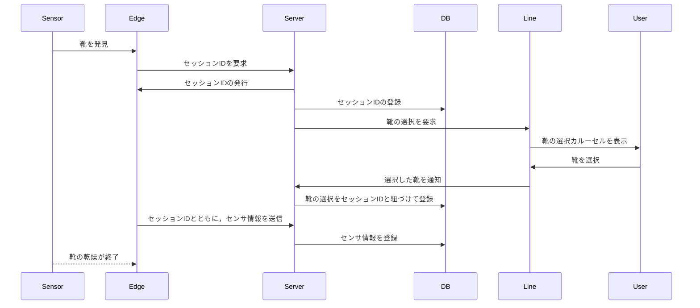

# シーケンス図

```mermaid
sequenceDiagram
    Sensor  ->>     Edge    : 靴を発見
    Edge    ->>     Server  : セッションIDを要求
    Server  ->>     Edge    : セッションIDの発行
    Server  ->>     DB      : セッションIDの登録
    Server  ->>     Line    : 靴の選択を要求
    Line    ->>     User    : 靴の選択カルーセルを表示
    User    ->>     Line    : 靴を選択
    Line    ->>     Server  : 選択した靴を通知
    Server  ->>     DB      : 靴の選択をセッションIDと紐づけて登録
    Edge    ->>    Server  : セッションIDとともに，センサ情報を送信
    Server  ->>    DB      : センサ情報を登録
    Sensor  -->>    Edge    : 靴の乾燥が終了

```
