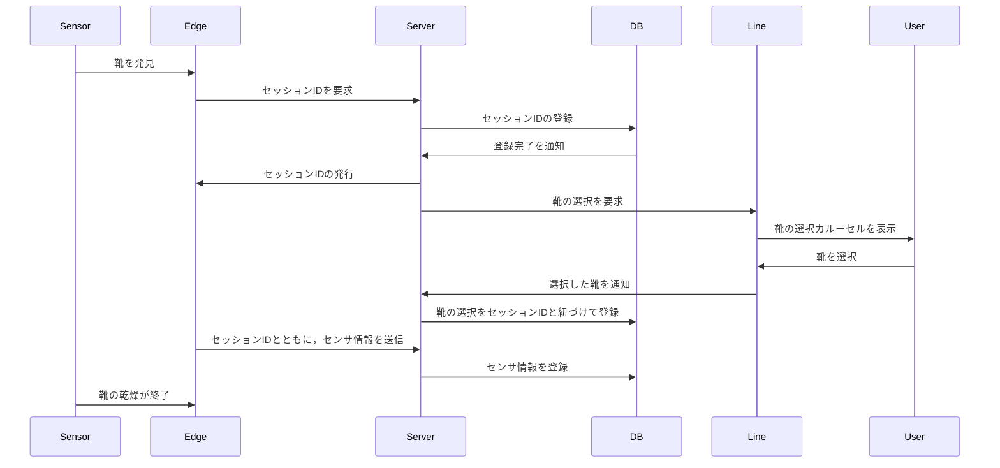
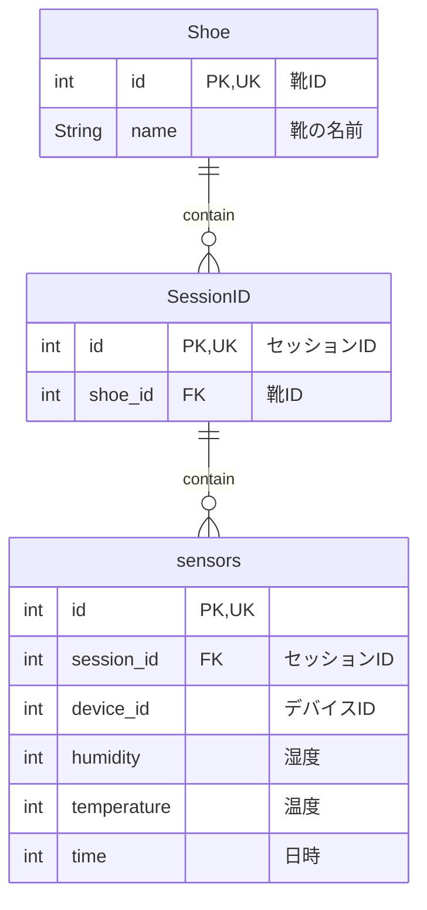

# 靴登録機能設計

## シーケンス図

```mermaid
sequenceDiagram
    Sensor  ->>     Edge    : 靴を発見
    Edge    ->>     Server  : セッションIDを要求
    Server  ->>     DB      : セッションIDの登録
    DB      ->>     Server  : 登録完了を通知
    Server  ->>     Edge    : セッションIDの発行
    Server  ->>     Line    : 靴の選択を要求
    Line    ->>     User    : 靴の選択カルーセルを表示
    User    ->>     Line    : 靴を選択
    Line    ->>     Server  : 選択した靴を通知
    Server  ->>     DB      : 靴の選択をセッションIDと紐づけて登録
    Edge    ->>     Server  : セッションIDとともに，センサ情報を送信
    Server  ->>     DB      : センサ情報を登録
    Sensor  ->>    Edge    : 靴の乾燥が終了

```

## ダイアグラム図

``` mermaid
erDiagram

sensors{
    int id PK,UK
    int session_id FK "セッションID"
    int device_id "デバイスID"
    int humidity "湿度"
    int temperature "温度"
    int time "日時"
}

SessionID{
    int id PK,UK "セッションID"
    int shoe_id FK "靴ID" 
}

Shoe{
    int id PK,UK "靴ID"
    String name "靴の名前"
}

SessionID  ||--o{ sensors : "contain"
Shoe ||--o{ SessionID : "contain"
```
